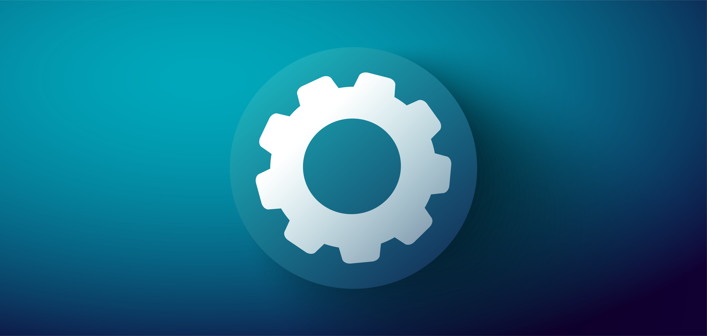

# TEX
* this project is owned as an NFT by Ali Husam Shakir AlKaraawi. You can have shares of it by participating to the project.


AUTODOX or TEX not decieded about the name yet.

This app is Notion.so clone, roamresearch clone and obsidian clone. The main purpose of this app is not to just clone these note taking apps but to make an all in one **Open source note taking app** with automation features.
## Goals
1. **Plugins** : plugins or extensions are customizations that you can add to your TEX application. For example, you can add grammar correction plugin like grammarly, or a machine learning plugin that help you abbreviation your text.
2. **Components** : In notion you may noticed that you can import a table when you hit `/` then type table then hit enter. The table called a component. In TEX you can create your own custom components. For example you can create flash cards. Also, you can use plugins to enhance your components. For example, you can use google translator plugin with flash card component so everytime you add a word you will get automatic translation.
3. **Services** : the is the core goal of TEX where you can create a google translator plugin and create flashcard components then put them all in one workspace (page) and you can publish that page so other people can use it. In other word you don't need to create new plugin and component for every user, instead one user can create all of them and share it with others.
3. **search** : We will have 5 search functionalities.
    - search for words in file
    - search for files names
    - global search for words in any files in any directory you choose
    - regular expression search.
    - save your search results and reuse them again.

5. **spreadsheet** : similar to microsoft excel you will have a spreadsheet where you can store your data and impiment formulas. Also, with plugins you can implement custom formulas like a stock market plugin. Last but not least, you can use these spreadsheets as a backend for your services. In other word the components will act as a frontend that interact with this spreadsheet.
5. **Ownership** : when you create a component, or a plugin or a service you will own it as an NFT. Hence, you can make money from it. There are three ways to make money with NFTs. One by selling it. Second, by getting percentage on every sell. Third, by requiring subscriptions fees like 7$ a month without selling the plugin or the service.
6. **benefits and vision** :
- First of all, i believe this new system will replace microsoft office and apple iwork.
- Users, will have safe place to store their data on the blockchain on IC. 
- Users can do whatever they can imagine with all these customizations.
- there are more feature that I will work one like live-time connection so you can share your documents and update them in real time. or like page components so you can have an entire page as a spread sheet.

7. **Will it be successful?**: Well, there are two types of products. First type is product that you need to convince people to use. The second it a product that people already looking for. By looking at the current market and youtuber I saw that apps like notion.so and quizlit are in high domands and I already saw youtubers how wish if quizlit have better feature and if notion have better features and have better security system. Well, giving all that our product is from the second type so it has a high probalbity of success and we will not need huge marketing for it.

- [Quick Start](https://smartcontracts.org/docs/quickstart/quickstart-intro.html)
- [SDK Developer Tools](https://smartcontracts.org/docs/developers-guide/sdk-guide.html)
- [Rust Canister Devlopment Guide](https://smartcontracts.org/docs/rust-guide/rust-intro.html)
- [ic-cdk](https://docs.rs/ic-cdk)
- [ic-cdk-macros](https://docs.rs/ic-cdk-macros)
- [Candid Introduction](https://smartcontracts.org/docs/candid-guide/candid-intro.html)
- [JavaScript API Reference](https://erxue-5aaaa-aaaab-qaagq-cai.raw.ic0.app)

If you want to start working on your project right away, you might want to try the following commands:

```bash
cd TEX/
dfx help
dfx config --help
```

## Running the project locally

If you want to test your project locally, you can use the following commands:

```bash
# Starts the replica, running in the background
dfx start --background

# Deploys your canisters to the replica and generates your candid interface
dfx deploy
```

Once the job completes, your application will be available at `http://localhost:8000?canisterId={asset_canister_id}`.
